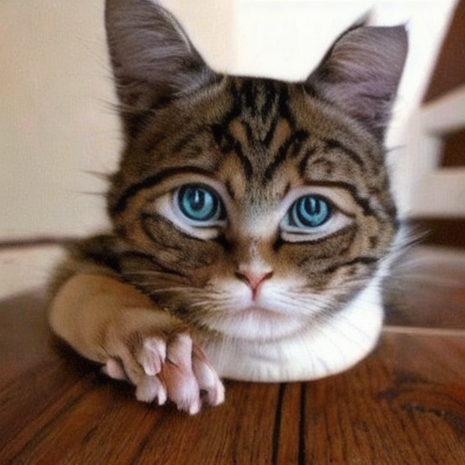
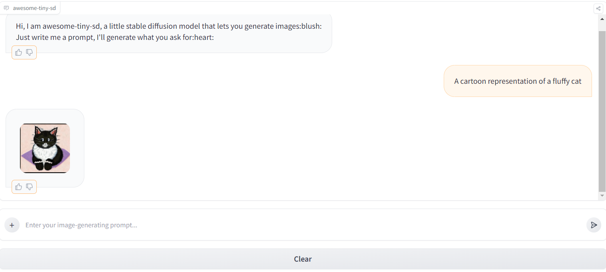

<div align="center">
    
   
   
   
   
   
   <div>
        <a href="https://cat-bounce.com/"></a>
        <p><i><b>Ernesto</b>, a mutant cat generated by awesome-tiny-sd, welcomes you to this page🤭... Click on it, you won't be disappointed</i></p>
   </div>
</div>

# awesome-tiny-sd

Run a stable diffusion model limitless, generate as many images as you want, free your fantasy!🐠

## Funding🥺

Please consider to support this project and its author, [Astra Bertelli](https://astrabert.vercel.app), by [sponsoring on GitHub](https://github.com/sponsors/AstraBert): if enough people sponsor this project, we'll be able to get to a GPU-powered Hugging Face space, to speed up image generation and unleash the true potential of **awesome-tiny-sd**!


## Overview

Tiny stable diffusion chatbot based on [segmind/small-sd](https://huggingface.co/segmind/small-sd) to generate image upon text prompts.


Try it [on Hugging Face Spaces](https://as-cle-bert-awesome-tiny-sd.hf.space):

<iframe
	src="https://as-cle-bert-awesome-tiny-sd.hf.space"
	frameborder="0"
	width="850"
	height="450"
></iframe>

Here is an example chat:



## Run awesome-tiny-sd locally
You can run **awesome-tiny-sd** locally through its Docker image:

```bash
docker pull ghcr.io/astrabert/awesome-tiny-sd:latest
docker run -p 7860:7860 ghcr.io/astrabert/awesome-tiny-sd:latest
```

**IMPORTANT NOTE**: running the app within `docker run` does not log the port on which the app is running until you press `Ctrl+C`, but in that moment it also interrupt the execution! The app will run on port `0.0.0.0:7860` (or `localhost:7860` if your browser is Windows-based), so just make sure to open your browser on that port and to refresh it after 1 to 5 mins (depending on your computer and network capacities), when the model and the tokenizer should be loaded and the app should be ready to work!

Another fundamental caveat is that we are dealing here with a relatively small stable-diffusion model (approx. 3GB), so the it is CPU-friendly (you can run it GPUless): to make the docker container work, indeed, 8GB RAM + 12 cores CPU can be enough, but image generation will be really slow. 

**You will need at least 16 to 32 GB RAM and/or a GPU to speed up the model.**

## Troubleshooting

* Q: The chatbot is taking ages to respond😭
    > A: It can happen on HF space and on GPUless, low-to-medium RAM local machines.
* Q: When I upload an image, an error is raised!🫠
    > A: This is because v0.0.0 does not support image2image generation: this is an upcoming feature
* Q: The generated images are inaccurate/bad quality/dysmorphic😵‍💫
    > A: That's not unfrequent with small stable diffusion models: it is an intrisic limitation and we can't do lots about it. The only suggestion is that, if you are not satisfied with the result, you just have to try with a more specific prompt: instead of saying "The cutest cat ever", type: "A digital art image of a super-cute and fluffy cat", for example.

## Upcoming features🚀

- [ ] Multi-lingual support (expected for **version 0.1.0**)

- [ ] Image augmentation, rescaling and improvement (expected for **version 0.2.0**)

- [ ] Image-2-image generation (expected for **version 1.0.0**)

## Contributing


Contributions are welcome! If you would like to improve the chatbot's functionality or add new features, please fork the repository and submit a pull request.

## References

- [Hugging Face](https://huggingface.co/)
- [Segmind small-sd model](https://huggingface.co/segmind/small-sd)
- [GradIO](https://www.gradio.app/)

## License

This project is licensed under MIT License.

If you use this work for your projects, please consider citing the author [Astra Bertelli](http://astrabert.vercel.app).
